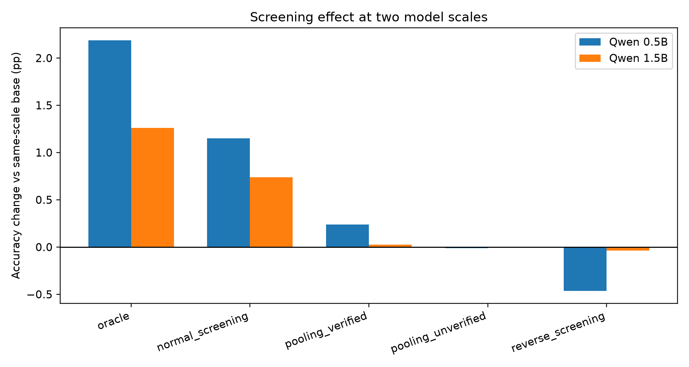

# Incentive Screening for Language-Model Feedback

Reproducibility package for a study of participation screening, costly verification, and preference-learning evidence in language-model feedback pipelines.

This repository contains the processed OpenAssistant data, policy configurations, training and evaluation code, HPC submission scripts, aggregate results, and paper figures used in the experiments.

## Main result

The experiments compare five feedback policies at two model scales: oracle filtering, normal screening, reverse screening, verified pooling, and unverified pooling. Each policy receives the same number of accepted preference pairs and is evaluated on the same clean held-out set.

Ten-seed results:

| Policy | Qwen 0.5B | Delta vs base | Qwen 1.5B | Delta vs base |
|---|---:|---:|---:|---:|
| Oracle | 71.94% | +2.19 pp | 71.39% | +1.26 pp |
| Normal screening | 70.90% | +1.15 pp | 70.86% | +0.74 pp |
| Verified pooling | 69.99% | +0.24 pp | 70.15% | +0.03 pp |
| Unverified pooling | 69.74% | -0.01 pp | 70.13% | 0.00 pp |
| Reverse screening | 69.29% | -0.46 pp | 70.09% | -0.04 pp |
| Same-scale base model | 69.75% | - | 70.125% | - |

The direction is consistent across scales: oracle and normal screening improve held-out preference accuracy over base, while reverse screening does not. The effect magnitude decreases at the larger model scale.

A verification-noise ablation shows that normal screening remains comparatively stable across verifier quality, whereas verified pooling degrades as verification becomes noisy.



## Important scope

The experiments are **semi-synthetic**:

- feedback content and contributor heterogeneity come from OpenAssistant;
- participation, rewards, verification, and sanctions are simulated;
- harmful feedback is represented by inverting preference labels;
- DPO is used as a practical preference-learning analogue of the RL-style aggregation channel.

These results are mechanism-level evidence and are not an evaluation of a deployed sanction system.

## Repository layout

```text
configs/                  policy and model configurations
data/processed/           processed OpenAssistant data used by the experiments
docs/                     experiment protocol, HPC instructions, and results
results/                  aggregate result tables and paired analyses
figures/                  paper-ready result figures
scripts/                  data preparation, training, evaluation, plotting, and HPC jobs
src/revision3/            reusable implementation
tests/                    unit and regression tests
```

## Quick start

Python 3.11 or 3.12 is required.

```bash
python3 -m venv .venv
source .venv/bin/activate
pip install -e .
pytest -q
```

The processed data are already included under `data/processed/`. To rebuild them from the source dataset:

```bash
python scripts/00_prepare_data.py
```

This downloads OpenAssistant `oasst1` through Hugging Face and creates:

- `oasst_typed_items.csv.gz`
- `oasst_preference_pairs.csv.gz`
- `oasst_test_pairs.csv.gz`
- `oasst_contributor_types.csv.gz`

## Reproducing the HPC experiments

The full matrices were run on HKU HPC 2021 using L40S GPUs and SLURM arrays. See [docs/HPC.md](docs/HPC.md) for environment setup and exact submission commands.

At a high level:

1. Prepare processed data.
2. Run the 0.5B five-policy matrix across seeds 42-51.
3. Run the 1.5B confirmation across seeds 42-51.
4. Run the four-level verification-noise ablation.
5. Generate summaries and figures with scripts `11`-`16`.

## Result files

- `results/types/`: contributor calibration
- `results/scale/`: ten-seed 0.5B analysis
- `results/confirm_1p5b/`: ten-seed 1.5B confirmation
- `results/noise/`: verification-noise ablation
- `figures/`: paper-ready figures

## Citation

This repository supports the paper:

> Incentive Screening for Language-Model Feedback: Theory and Preference-Learning Evidence.

A final bibliographic entry will be added after publication.
