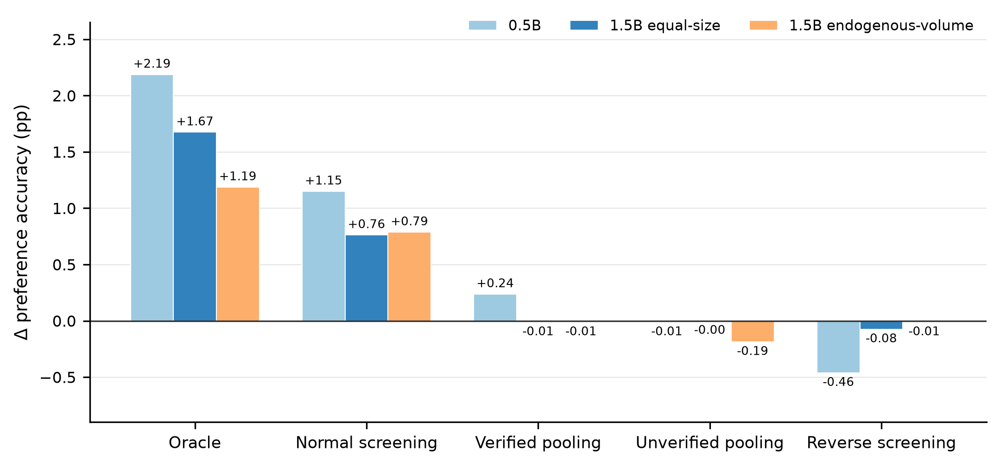

# Incentive Screening for Language-Model Feedback

Reproducibility package for a study of participation screening, costly verification, and preference-learning evidence in language-model feedback pipelines.

This repository contains the processed OpenAssistant data, policy configurations, training and evaluation code, HPC submission scripts, aggregate results, mechanism-regime simulation, and paper figures used in the experiments.

## Main result

The experiments compare five feedback policies: oracle filtering, normal screening, reverse screening, verified pooling, and unverified pooling. The primary Qwen2.5-1.5B confirmation uses ten seeds and two accepted-pool designs:

- **Equal-size:** every policy receives 2,000 accepted preference pairs, isolating composition and label quality.
- **Endogenous-volume:** each policy receives the accepted volume generated by participation and verification: oracle 4,584; normal screening 2,000; reverse screening 1,882; verified pooling 3,880; unverified pooling 4,584.

Mean held-out preference-accuracy change relative to the same-scale base model:

| Policy | Qwen 0.5B (10 seeds) | Qwen 1.5B equal-size | Qwen 1.5B endogenous-volume |
|---|---:|---:|---:|
| Oracle | +2.19 pp | +1.68 pp | +1.19 pp |
| Normal screening | +1.15 pp | +0.76 pp | +0.79 pp |
| Verified pooling | +0.24 pp | -0.01 pp | -0.01 pp |
| Unverified pooling | -0.01 pp | 0.00 pp | -0.19 pp |
| Reverse screening | -0.46 pp | -0.08 pp | -0.01 pp |
| Same-scale base model | 69.75% | 70.125% | 70.125% |

The direction is stable across scales and accepted-pool designs: oracle and normal screening improve held-out preference accuracy over base, while reverse screening does not. Normal screening beats reverse screening by about 0.8 pp with a 95\% confidence interval excluding zero in both matched-budget 1.5B designs.

A volume-proportional sensitivity preserves the direction but is not statistically distinguishable: normal screening beats reverse by 0.55 pp, 95\% CI [-0.10, 1.20], while oracle improves by 3.49 pp. See `docs/VOLUME_PROPORTIONAL_RESULTS.md`.

A verification-noise ablation shows that normal screening remains comparatively stable across verifier quality, whereas verified pooling degrades as verification becomes noisy.



## Important scope

The experiments are **semi-synthetic**:

- feedback content and contributor heterogeneity come from OpenAssistant;
- participation, rewards, verification, and sanctions are simulated;
- harmful feedback is represented by inverting preference labels;
- DPO is used as a practical preference-learning analogue of the RL-style aggregation channel.

These results are mechanism-level evidence and are not an evaluation of a deployed sanction system.

## Repository layout

```text
configs/                  policy and model configurations
data/processed/           processed OpenAssistant data used by the experiments
docs/                     experiment protocol, HPC instructions, and results
results/                  aggregate result tables and paired analyses
figures/                  paper-ready result figures
scripts/                  data preparation, training, evaluation, plotting, and HPC jobs
src/revision3/            reusable implementation
tests/                    unit and regression tests
```

## Quick start

Python 3.11 or 3.12 is required.

```bash
python3 -m venv .venv
source .venv/bin/activate
pip install -e .
pytest -q
```

The processed data are already included under `data/processed/`. To rebuild them from the source dataset:

```bash
python scripts/00_prepare_data.py
```

This downloads OpenAssistant `oasst1` through Hugging Face and creates:

- `oasst_typed_items.csv.gz`
- `oasst_preference_pairs.csv.gz`
- `oasst_test_pairs.csv.gz`
- `oasst_contributor_types.csv.gz`

## Reproducing the HPC experiments

The full matrices were run on an institutional HPC cluster using L40S GPUs and SLURM arrays. See [docs/HPC.md](docs/HPC.md) for environment setup and exact submission commands.

At a high level:

1. Prepare processed data.
2. Run the 0.5B five-policy matrix across seeds 42-51.
3. Run the Stage 5 1.5B confirmation across equal-size and policy-specific-pool designs with `scripts/run_hpc_stage5_combined.sbatch`.
4. Run the volume-proportional confirmation with `scripts/run_hpc_volume_proportional.sbatch` after generating its manifest.
5. Run the four-level verification-noise ablation.
6. Run `scripts/16_plot_mechanism_regime.py` for the calibrated regime/composition figure.
7. Generate paper figures with `scripts/17_make_paper_figures.py`.

## Result files

- `results/types/`: contributor calibration
- `results/scale/`: ten-seed 0.5B analysis
- `results/confirm_1p5b/`: earlier ten-seed 1.5B equal-size confirmation
- `results/stage5/equal_size/`: final ten-seed 1.5B equal-size analysis
- `results/stage5/endogenous/`: final ten-seed 1.5B policy-specific-pool analysis (legacy artifact name)
- `pilot_results/volume_proportional/`: preregistered volume-proportional manifest and dry-run report
- `results/stage3/`: completed volume-proportional sensitivity results
- `docs/STAGE5_CONFIRMATION.md`: concise final confirmation report
- `results/noise/`: verification-noise ablation
- `results/mechanism/`: calibrated regime, participation, intensity, and composition simulation
- `figures/`: paper-ready figures

## Citation

This repository supports the paper:

> Incentive Screening for Language-Model Feedback: Theory and Preference-Learning Evidence.

A final bibliographic entry will be added after publication.
